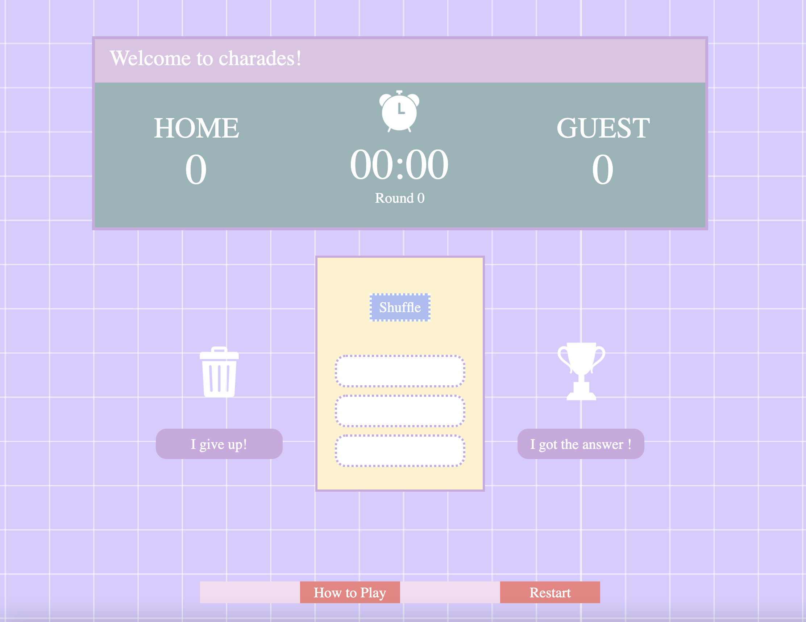

[1] Unicorn Charades
My friends and I like to play triple x chrades for fun. It can be sort of embrassing but also extremely entertaining. 
We have the deck of card that comes with the game set with words to choose from, but we always use our phone to time ourselves.
I thought it'd be nice to use a website to do the countdown for us. I also would like to add an option to make our own list of words to choose from in the future. 

[2] Visual of Unicorn Charades

[3] Following technologies were used to build Unicorn Charades:
    1) HTML
    2) JavaScript
    3) CSS
    4) procreate (ipad drawing app)
    5) Keynote program

[4] HOW TO:

This game follows a very typical charade rules.
Instruction:
 1) Pick Team Home & Guest. Team Home will go first. 
 2) You will each have 3 rounds to play charades.
 3) Click on <i>Shuffle</i> button to see your word choices. 
*** Each word has different level of difficulty! ***
** 1 diamond = Easy,  2 diamons = Medium,  2 diamons = Hard **
4) Select your word and appropriate timer will start.
5) Do your best acting! 
6) If your team got it right, click on "I got the answer!" if not click on "I give up!".
7) You can always press "Restart" button to start from the top. 
                           

[5] ICEBOX ITEMS for the futture:
    1) Let users choose their team names.
    2) Grab words data sample via API or let users type them in.
    3) Utilize an array to create div per word instead of having 3 html divs for possible scale up.
    4) Add favicon
    5) Background music during countdown!
    6) Light up current player's name as an indicator.
    7) More points added when you get more difficult words.
